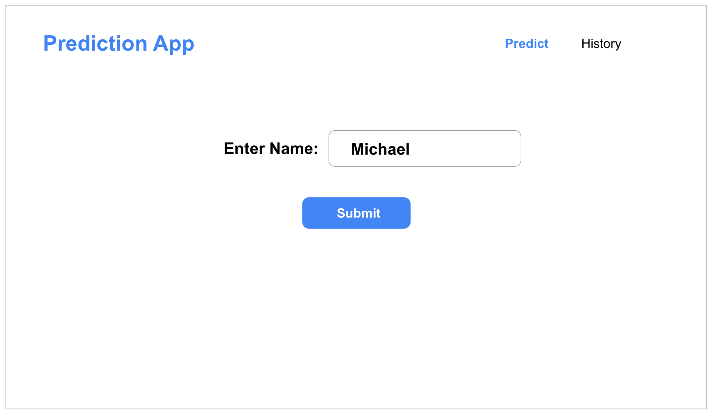
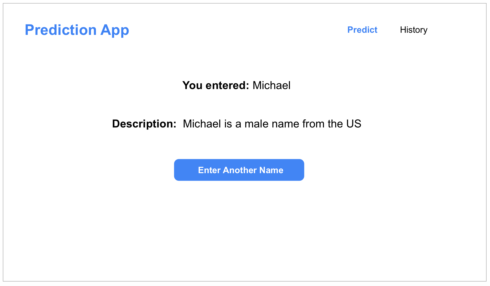
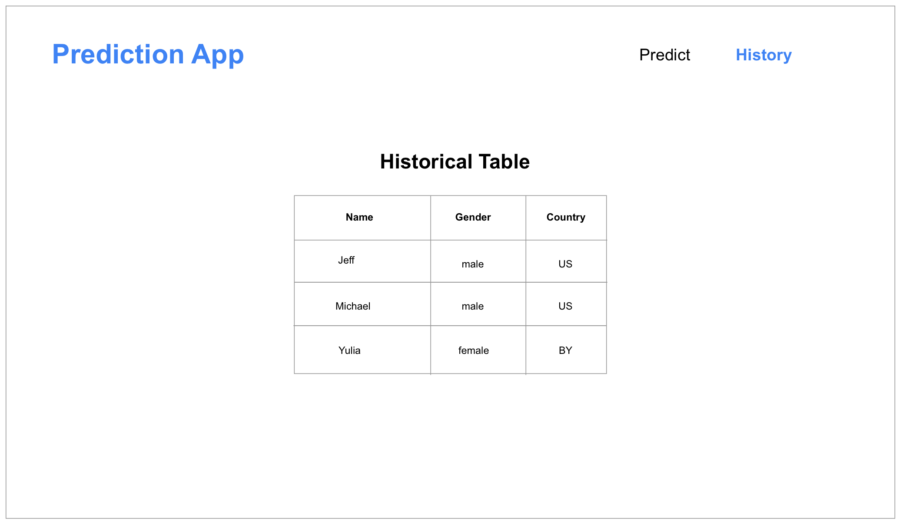

# ReactJS Code Challenge - Co.dev

Welcome to co.dev’s code challenge.

## Task
We are looking to create a gender and nationality prediction app.

In the home page, the user can enter a random name and based on the response of the API, the user will be guided to a new page with the results which includes:

1. The name of the inputted name
2. The description of the name (including gender and location of origin of the name)
3. A button to be able to enter a new name.  If the result from the API is empty, the description should be empty (It is up to you to determine what happens when the user clicks the “Enter Another Name” button)

When the user clicks the History tab, there should be a history of what the user has searched along with data points of those results.  Assuming there is a high number of results, the result should be scrollable.

Please make sure that the application is responsive and also looks good on a mobile screen.

It is your chance to show off your coding skills!  Please make an app that uses an efficient use of folder structure with styling, redux, API helpers, etc that is scalable.

## Design




## APIs
```
# GET https://api.nationalize.io/?name=michael
# GET https://api.genderize.io/?name=michael
```
## What we are looking for
1. Typescript
2. Redux
3. API helper function
4. React Hooks
5. Scalability
6. Folder Structure
7. Testing
8. Responsive styling

## Upon Completion
Please send a link to the github repo to andrew@co.dev and notify the recruiter once complete. Good luck!
